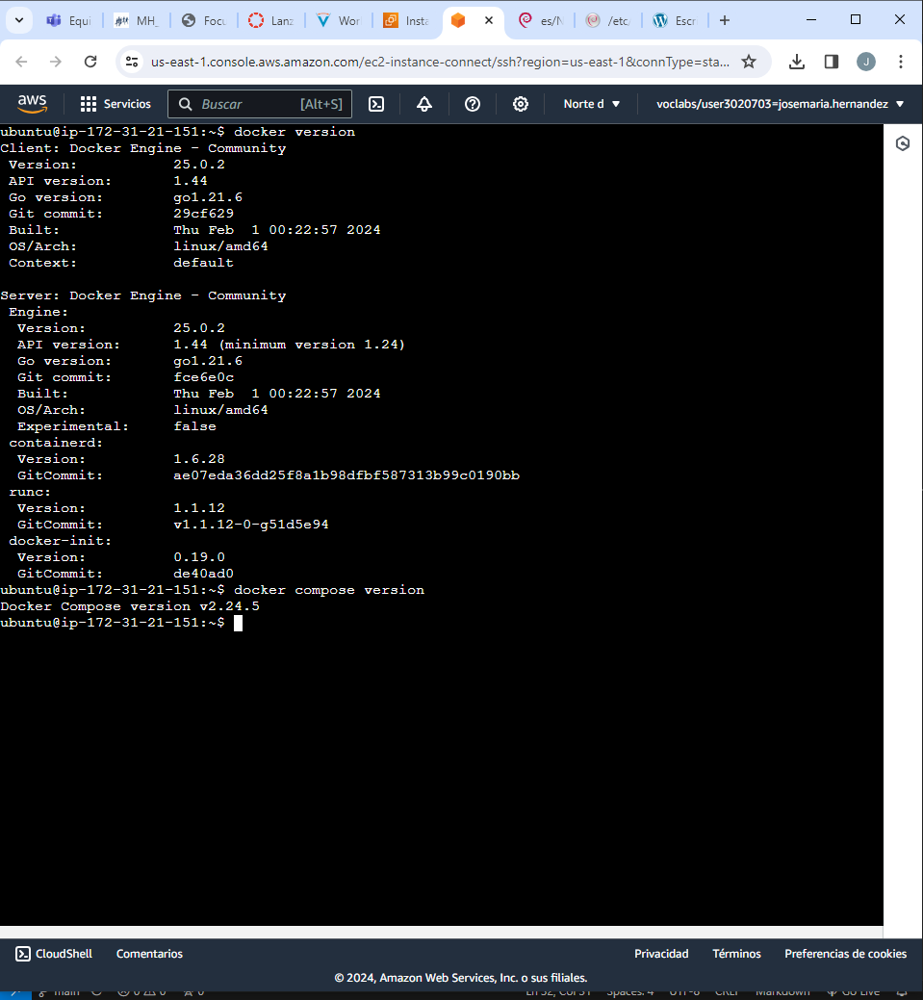
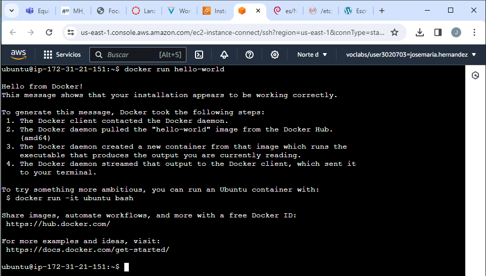
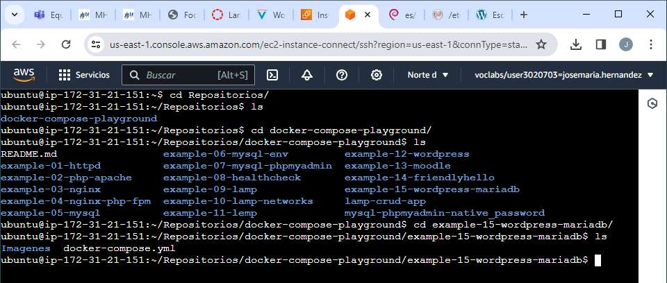
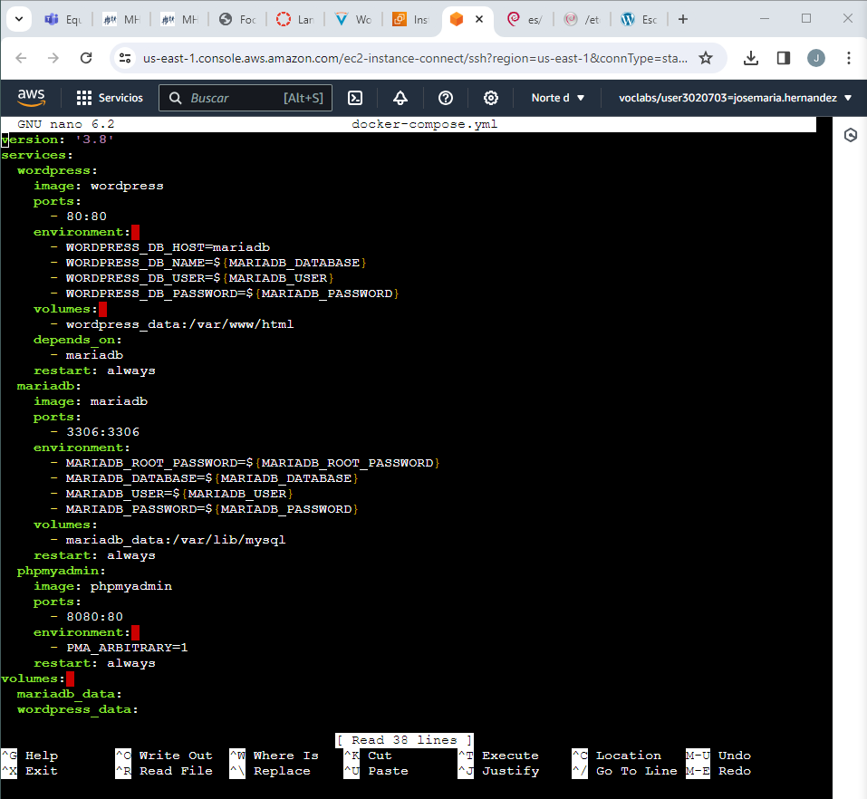
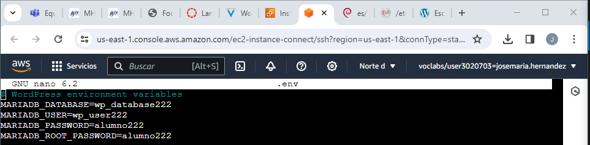
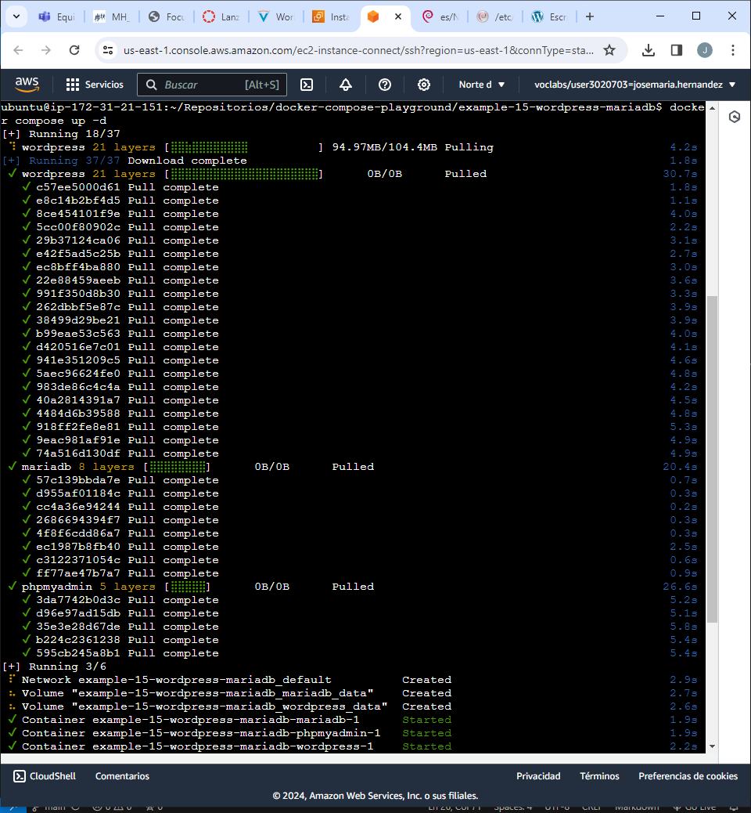
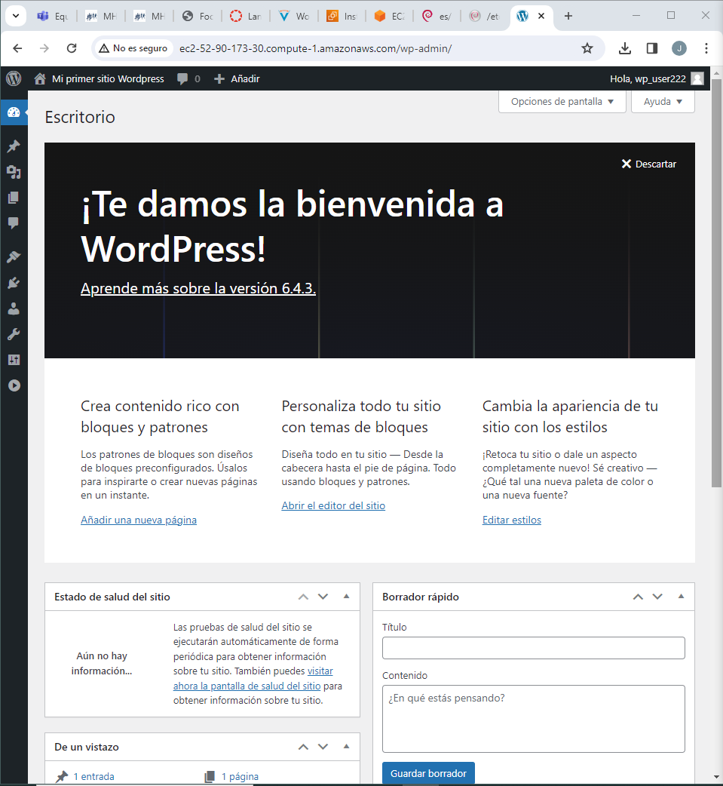

# Actividad 1.3.1 WordPress con Dockers

En esta práctica tendremos que realizar la instalación de WordPress en una instancia EC2 de Amazon Web Services como en la práctica anterior, pero esta vez lo haremos con Dockers. Para ello lo que tendremos que hacer será instalas y configurar Docker y Docker compose en la máquina virtual.

Primero desinstalaremos los paquetes que pueden entrar en conflicto.
``` 
$ for pkg in docker.io docker-doc docker-compose docker-compose-v2 podman-docker containerd runc; do sudo apt-get remove $pkg; done
```
Ahora tenemos que instalar usando un repositorio, por lo que tendremos que ejecutar los siguientes comandos.
``` 
sudo apt-get update
sudo apt-get install ca-certificates curl
sudo install -m 0755 -d /etc/apt/keyrings
sudo curl -fsSL https://download.docker.com/linux/ubuntu/gpg -o /etc/apt/keyrings/docker.asc
sudo chmod a+r /etc/apt/keyrings/docker.asc
```
Después tendremos que agregar el repositorio a las fuentes de Apt
```
echo \
  "deb [arch=$(dpkg --print-architecture) signed-by=/etc/apt/keyrings/docker.asc] https://download.docker.com/linux/ubuntu \
  $(. /etc/os-release && echo "$VERSION_CODENAME") stable" | \
  sudo tee /etc/apt/sources.list.d/docker.list > /dev/null
```
Y hacemos un update con ```sudo apt-get update```

Ahora tenemos que instalar el motor de docker con el siguiente comando:
```
sudo apt-get install docker-ce docker-ce-cli containerd.io docker-buildx-plugin docker-compose-plugin
```
Comprobamos que tenemos instalado docker y docker-compose



Tenemos que gestionar docker con un usuario que no sea root, en nuestro caso será con el usuario ubuntu, por lo que tenemos que agregar el usuario ubuntu al grupo de docker. Para hacer esto usamos el comando ```sudo usermod -G docker ubuntu```.  
Comprobamos que podemos usar dockers con el usuario.



Con esto abremos finalizado la instalación de dockers en nuestra máquina virtual. Ahora tenemos que clonar el repositorio donde esta el contenedor con WordPress, phpMyAdmin y MariaDB. Este repositorio le hemos hecho un fork desde los Repositorios del profesor y lo hemos clonado en nuestra máquina virtual. Tendremos que ir al ejemplo 15, donde esta el contenedor que nos interesa.



Primero vamos a ver el docker-compose.yml para ver lo que tiene configurado, que debería ser el wordpress, el mariadb y el phpmyadmin.



Pero aquí no deberemos tocar nada de la configuración, tenemos que poner las variables de nuestra base de datos que creamos con anterioridad en el archivo oculto *.env*. Dicho archivo deberá quedar de la siguiente manera.



Ahora tenemos que iniciar nuestro sitio docker. Este proceso puede tardar unos minutos.



Una vez terminado este proceso vamos a nuestro navegador para acceder a nuestro sitio en  WordPress. Para ello copiamos la ip pública que nos ofrece AWS.

Nos pedirá acceder con los datos que están guardados en nuestro archivo *.env*. Una vez introducidos estos datos tendremos acceso al panel de control de WordPress.

